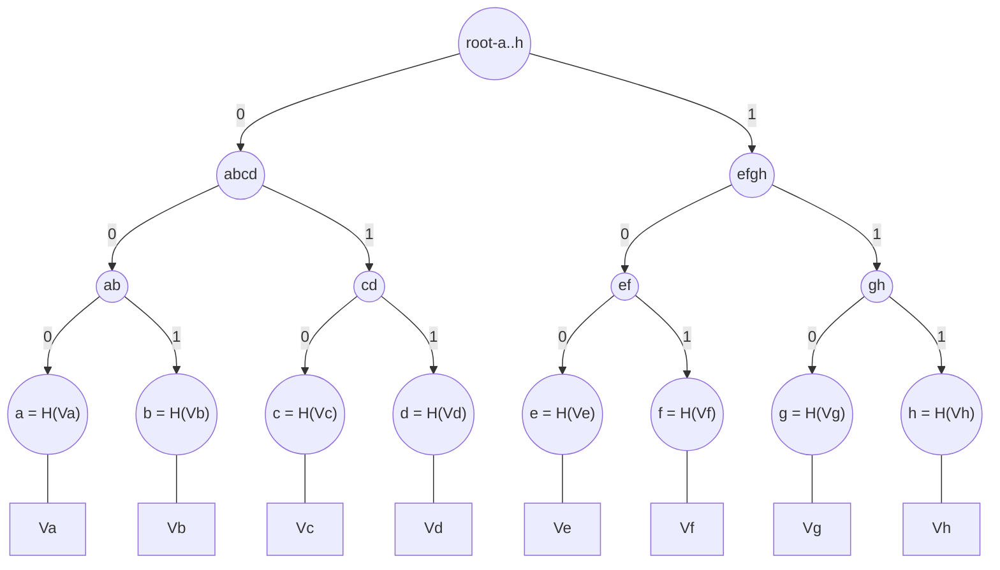

import Image from 'next/image'

# Sparse merkle trees

## Introduction

Sparse Merkle Trees (SMTs) are a cryptographic data structure used primarily in blockchain systems and other decentralized applications to efficiently prove the inclusion or absence of key-value pairs in a large dataset.
They are particularly useful in situations where the dataset is too large to store in its entirety, but where proofs of inclusion or absence are required.

## Structure of a Sparse Merkle Tree

A Sparse Merkle Tree is a binary tree where each leaf node represents a key-value pair, and each non-leaf node represents the hash of its child nodes.
Unlike traditional Merkle Trees where every leaf node contains a key-value pair, in a Sparse Merkle Tree, leaf nodes only contain key-value pairs that are present in the dataset.

### Nodes

At the bottom level, every node (also called leaf for the lowest level) is just the hash of it's data `hash(V)`, where `V` is the data that is put into the leaf.
In every level above, each node is the hash of the previous two nodes concatenated: `ab = hash(a || b)`.
This is the repeated in every level up to the root.

Notice that the root therefore implicitly is a result of hashing all the nodes and leafs below the root.
That means that if you change the value of any node or leaf in the tree, the root will change.

### Keys

Notice the labels that each connection between any node has in the diagram above.
It can either be 0 or 1 and every connection has one of these two labels assigned to it.
If you walk the path to a leaf and write down each label you encounter one-by-one, you arrive at the key in bitwise form.

For example, the leaf `f` from the diagram will have the key `K_b = 101`, which would be `5` as a decimal number.
Therefore, this would represent the key-value pair of `(5, Vf)` encoded in a merkle tree.

Notice that as you go down the tree, every 0 you encounter corresponds to the left path, while every 1 does so for the right path.

To recap: Every leaf (remember, node at the very bottom) has a key (also called index), which is used to determine the path where this leaf is located inside the tree.

### Merkle proofs

In a lot of applications, we want to proof to a verifier that the value `Vf` with key `f` is inside a merkle tree that has the root `r`.
Notice that the verifier only has the root `r`, and nothing else.
In this case, we can create a so-called "merkle proof", which will proof that our value `Vf` is indeed inside that tree.

For that, we send the verifier:
- the value `Vf`
- the key `f`
- The siblings `e`, `gh` and `abcd`

The verifier can now recursively use the siblings we provided to reconstruct the root and check that against the known root `r`:
1. He computes `H(Vf)`
2. He re-computes the node `ef` by using the sibling `e` and hashing them together `ef = hash(e || f)`
3. He does the same in the next level with the sibling `gh`: `efgh = hash(ef || gh)`
4. Now he can do it again at the root-level `root = hash(abcd || efgh)`

Now the verifier can check that the calculated `root` equals the known root `r` and therefore has verified that `Vf` is indeed in that tree.
